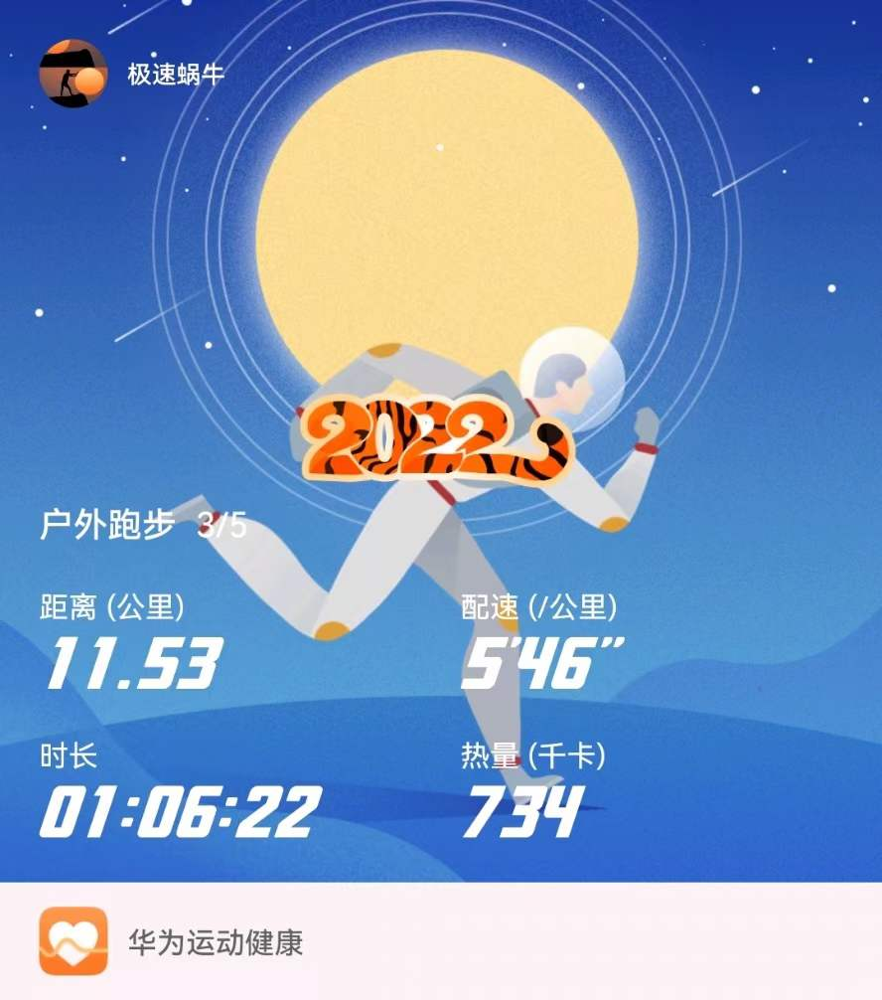
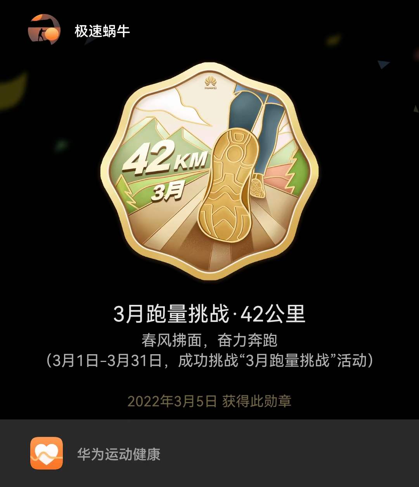
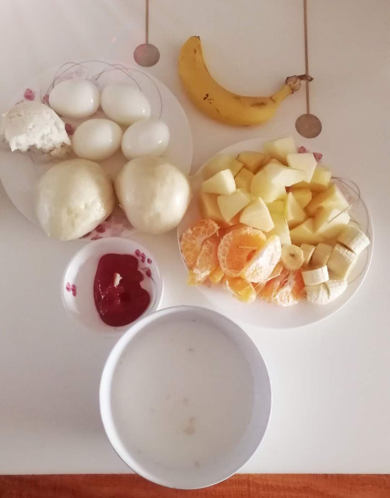
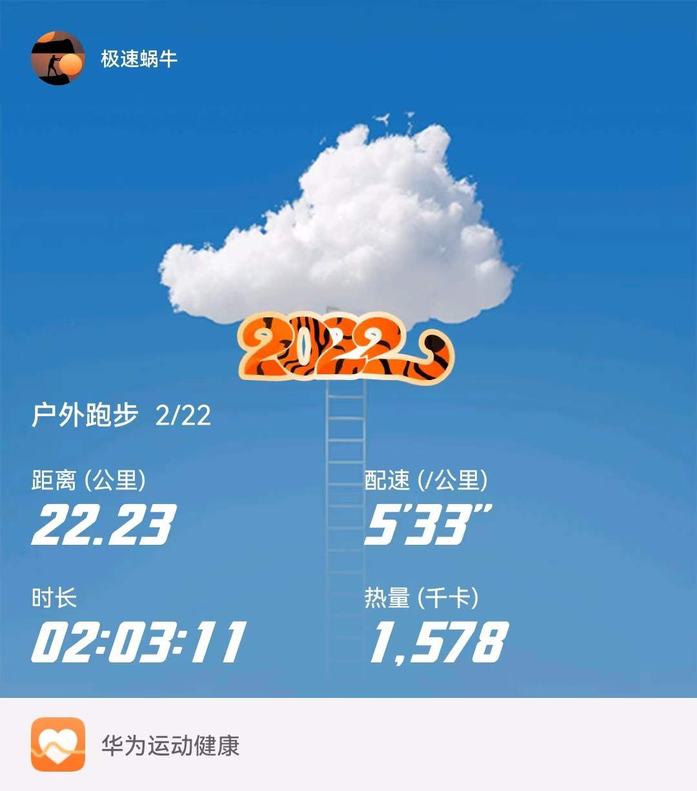
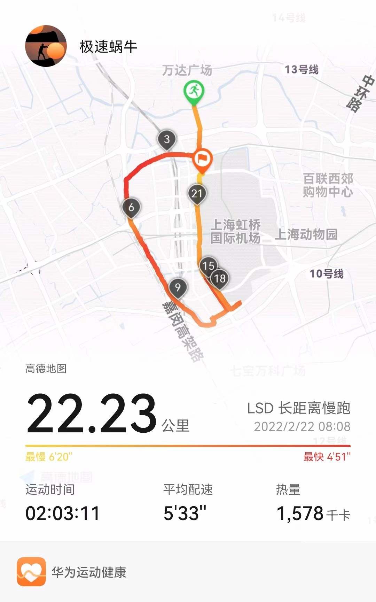
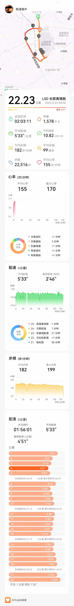

# 跑者世界：生命在于运动，健康在于坚持！

## 2022年3月5日
```
阳春3月，最适合跑步的季节！
```



## 2022年3月4日
```
农历二月初二，龙抬头的日子。
理发预示好兆头，吃饺子预示团圆美满。
无论形式如何，生活需要仪式感。
认真的对待每一天，真实幸福的生活，也不过如此吧。
```


## 2022年3月3日
```
“又是一年三月三，风筝飞满天。牵着我的思念和梦幻，又回到从前....”
每年都会想起的歌谣，温馨慢慢，回忆流淌。
```

## 2022年2月28日
```
  上周六，难得好天气，最高18度。
  午饭后驱车100km，抵达滴水湖。
  跑了一圈 ,打卡留念。
```


## 2022年2月23日
* 古今之成大事业、大学问者，必经过三种之境界。
####   :+1:“昨夜西风凋碧树，独上高楼，望尽天涯路”，此第一境也；
####   :+1::+1:“衣带渐宽终不悔，为伊消得人憔悴”，此第二境也；
####   :+1::+1::+1:“众里寻他千百度。蓦然回首，那人却在，灯火阑珊处。”，此第三境也。
- 王国维《人间词话》

## 2022年2月22日
*  今天是个特别的日子，好多2。跑了22.22公里，半马配速2小时内 :+1:
-  充实愉快的一天，全新的开始 😅
###  虎虎生风——上云霄！

### 虎头虎脑——闯江湖！

### 虎虎生威——跑世界！


# 跑者世界——运动日志
- 2020年6月17日，正式开跑！
```
  从一只慢速蜗牛起步，跑成一只极速蜗牛！
  生命在于运动，健康在于坚持！
***
- running!
- running!
- running!
***
```

