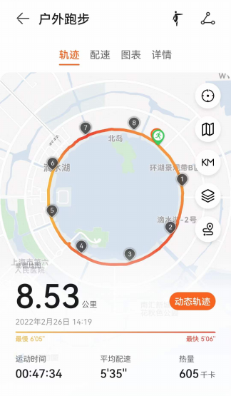

# 2022年2月22日
*  今天是个特别的日子，有好多2。跑了22.22公里，半马配速2小时内 :+1:
-  充实愉快的一天，全新的开始 😅

# 2022年2月23日
* 古今之成大事业、大学问者，必经过三种之境界。
####   :+1:“昨夜西风凋碧树，独上高楼，望尽天涯路”，此第一境也；
####   :+1::+1:“衣带渐宽终不悔，为伊消得人憔悴”，此第二境也；
####   :+1::+1::+1:“众里寻他千百度。蓦然回首，那人却在，灯火阑珊处。”，此第三境也。
- 王国维《人间词话》

# 2022年2月28日
```
  上周六，难得好天气，最高18度。
  午饭后驱车100km，抵达滴水湖。
  跑了一圈 ,打卡留念。
```

