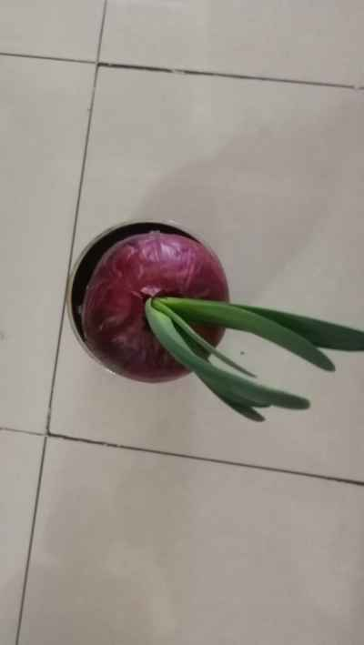

## 2022年4月12日  [生活日志](../life.md)
- 早安，第10天(疫情满月有感)
```
今天封控在家满月了，最新的三区管理政策，我们和隔壁小区依然榜上有名（至少7+7），继续闭关修炼。
大米面粉储备充足，蔬菜奇缺，采购困难。
家中巧妇，奇思妙想，洋葱发芽，权当小葱。
每顿一片，可度数日。
赞之叹之，幸甚至哉!!!
```
- 赋诗一首：
```markdown
      《浮生偶记一则》
  水培洋葱育新苗，每日一片味极鲜。
  一日三餐人世间，浮生偶记不慕仙。
```  
- 水培洋葱育新苗

- 每日一片味极鲜  

- 一日三餐人世间，浮生偶记不慕仙。  

