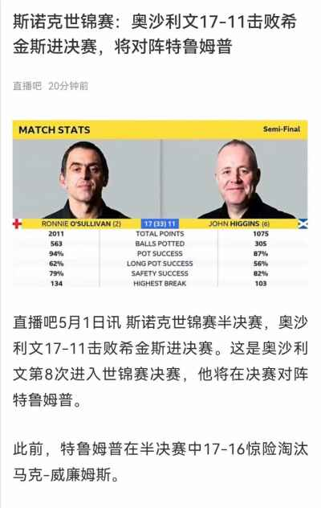

## 2022年5月1日  [生活日志](../life.md)
- 早安，第29天（细节决定成败）
```markdown
聚水成海，聚沙成塔，从小做起，未来可期。
```
- 期待火箭升空
```markdown
2022年的斯诺克世锦赛，火箭-奥沙利文17:11击败巫师-希金斯；金左手马克威廉姆斯16:17惜败特姆鲁普。
火箭，巫师，金左手，都是我喜欢的顶级大神，姜还是老的辣。
四强席位，75三杰雄踞三席。
斯诺克变养老运动了吗？
后浪们要加油啦！
一代要更比一代强啊！
```  
- 步步为营
  
- 养老运动
  
