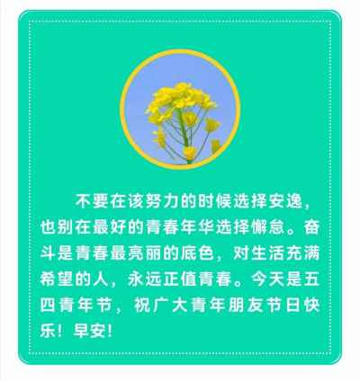

## 2022年5月4日
- 早安，青年节日快乐（18岁~65岁的同龄）
```markdown
最新的国际标准，我也是大龄青年一枚。
昨日小区新增一例羊，继续7+7套餐。封控直奔2月新记录，加油。
昨晚11点，发了蔬菜物资，好心邻居也互换援助了很多，可以再坚持半个月了。
80岁才到老年人的国际标准线，你有什么理由选择躺平呢？努力奋斗吧。
加油，青年人^_^
```
- 新时代年龄划分

|年龄段|世界观|行为表现|
|:----|:----|:----|
|未成年（0-17岁）|相信一切童话都是真的|极力模仿
|青年人（18-65岁）|怀疑一切道理都是假的|总是叛逆
|中年人（66-79岁）|认清了世界的半真半假|处事稳重
|老年人（80-99岁+）|体会到真假并不重要，重要的是不较劲、不折腾、难得糊涂，就会天天快乐|与世无争

- 新时代年龄

- 前进

- 奋斗  

- 飞翔  

