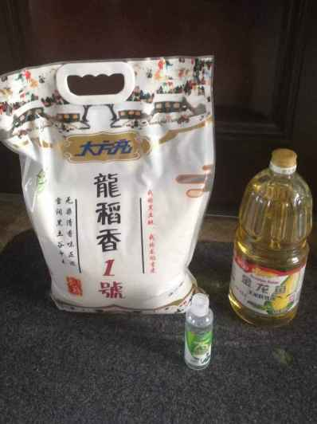

## 2022年5月9日  [生活日志](../life.md)
- 早安，求物资（感谢投喂）  
>继续全域静默3天，停止一切外卖和快递，物资紧缺。  
感谢政府的投喂，不知不觉，这2个字让人热泪盈眶。  
今天上午7点核酸，下午17点出结果，可谓神速。  
定睛一瞅，原来是邻居市区的支援，效率大幅增速。
利好消息是，许多患者恢复正常离舱，方舱有空位了^-^
同时也意味着，如果不幸成羊，待遇会有提高^_^
继续加油，解封不远了！！！
- 物资投喂   
  
  
