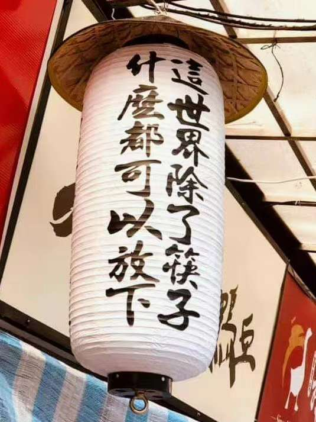
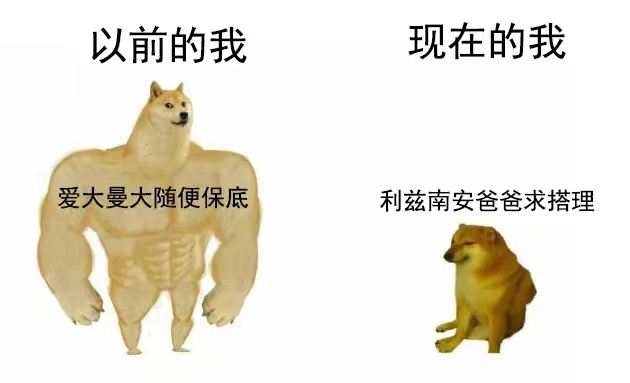
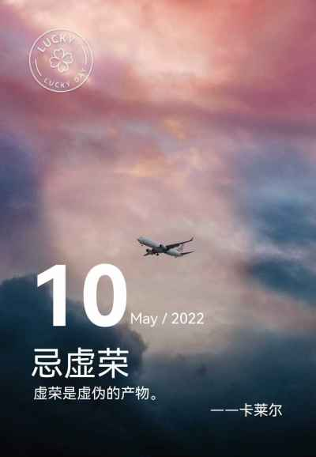
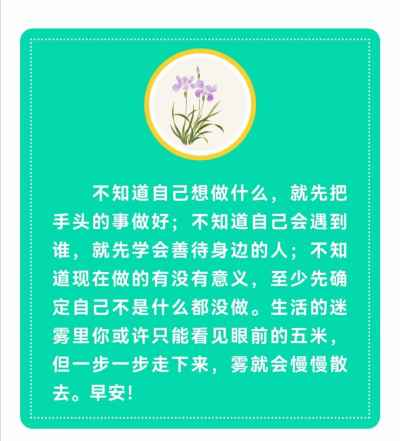

## 2022年5月10日  [生活日志](../life.md)
- 早安，投喂感想（二杠人生和外卷）
>首先，非常开心。盼望已久的物资，昨天终于拿到手了。  
感谢政府的投喂，不知不觉间，投喂这两个字爆红网络刷屏的字眼，让人热泪盈眶。  
家有余粮，心里不慌。  
老百姓就是这么务实，哪怕有千般万般的痛苦无奈，只要有一点点实际的收益，都会欢欣鼓舞，溢于言表。  
普通人没有那么高的思想境界和觉悟，他们只是明白一个简单朴素的道理：民以食为天。
一日三餐，这个平日里再微不足道的一件小事，在这样的特殊时期（疫情封控58天，物资奇缺），也是关乎生死存亡的大事。  
日常生活中充满了这样的类比：同样一件事，对于不同的人，会有完全不同的意义和重要性。  
所以，我们都应该学会换位思考。  
尤其是那些掌握了分配和决定权利的人，如何平衡处理各种疑难的复杂关系，取舍之间，是许多凡人的一生。
>>- 许多人的人生,如同两根筷子一样，又直又二，不会曲折拐弯。宁折不弯，往往很悲剧。    
**解药**：中庸之道，明哲保身的生存智慧，还是很有必要的。无论如何，生存都是第一位的；伟大的精神和灵魂，也是孕育于健康的身体。 
>>- 对于教育行业，内卷已经不稀奇了，看看外卷有多卷吧。  
**解药**：忌虚荣，脚踏实地，方可成就一片天地。  
> 
> 行而不辍，知行合一。所谓的迷茫，其实就是空想太多而没有行动。   
> 

- 筷子人生  

- 外卷

- 忌虚荣  
  
- 知行合一  
  
