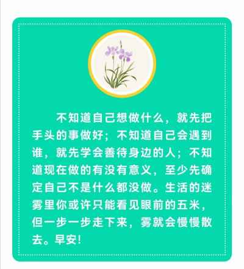

## 2022年5月12日  [生活日志](../life.md)
- 早安，封控2月（疫情纪念）
>全国防灾减震日（2008.5.12汶川大地震）
5.12，致敬灾难中努力拼搏的人们。  
今天，是汶川大地震纪念日，为逝去的生命默哀！  
今天，封控蜗居家中，满2个月了。
全新的生活模式，舒缓的生活节奏，每日为三餐奔波（团购快递），为健康努力（抗核套餐）。  
在这个黑天鹅频发的时代，无论疫情，战争，天灾人祸，都会深刻影响改变正常的社会生活秩序。  
我们需要勇敢面对，迎难而上。  
困难只是暂时的，坚持到底，光明就在前方。  
最终的胜利一定属于我们。 
人类漫长的进化史用事实无比确定的验证实践着这一真理。
- 纪念

- ”和平鸽“

- 行动  

