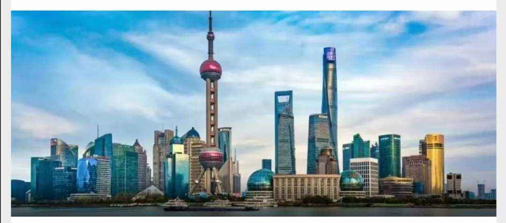
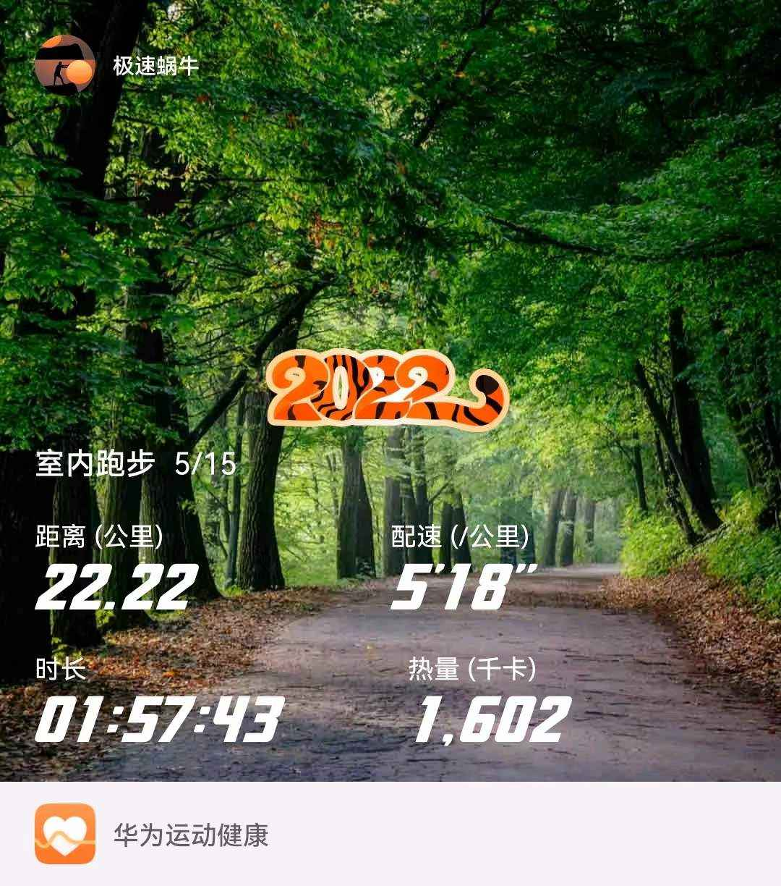
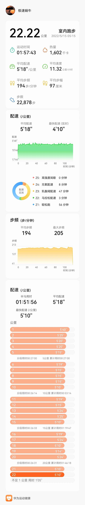

## 2022年5月15日  [生活日志](../life.md)
- 早安，上海（此心安处是吾乡）
```markdown
疫情阻挡不住奔跑的脚步，第6个室内半马。
配速5分18秒，用时1小时52分左右。
在《苏东坡诗词》（台大刘少雄老师的公开课）的陪伴中，顺利完成了4月底受伤一周后的第2个半马。
配速和体感，感觉非常舒适。
最近疫情防控效果突出，好消息不断。
这几天政府也投喂了牛奶，面包，牛肉等物资。
恢复正常节奏的上海，始终是值得信赖和依靠的。
奔跑中，听到“此心安处是吾乡”，深以为然。
在如今矛盾不断，竞争日剧的社会中，多少人为了生存南漂北漂；
又有多少人深陷欲望泥潭，无法自拔。
其实，人类从出生开始，就是来自然界和宇宙大世界做客的。
太多人，反客为主，以为我们可以改造自然，创造新世界。
人类，真的可以改变世界吗？
千百年后，我们化作了尘土，而自然界和宇宙界，始终是永恒的存在。
我们能改变的，只是我们自己而已，只有我们自己以为的世界罢了。
从这个意义上来说，每个人都是这个世界的客人，地球也只是我们的异乡而已。
你以为的家乡，又有什么是真正属于你的私有财产。
人生如逆旅，我亦是行人。
此心安处是吾乡，此中有真意，欲辨已忘言。
``` 
- 此心安处是吾乡

- 室内半马6  

- 室内半马6
  
