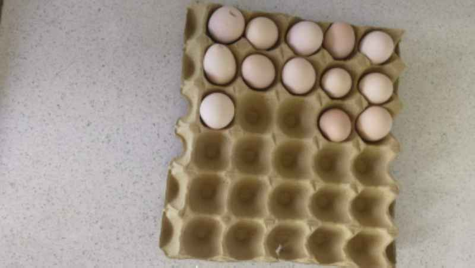
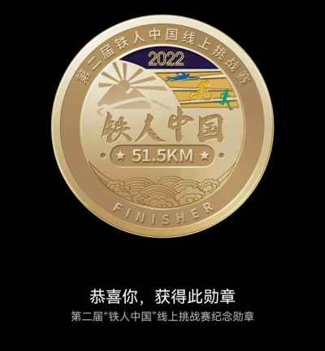
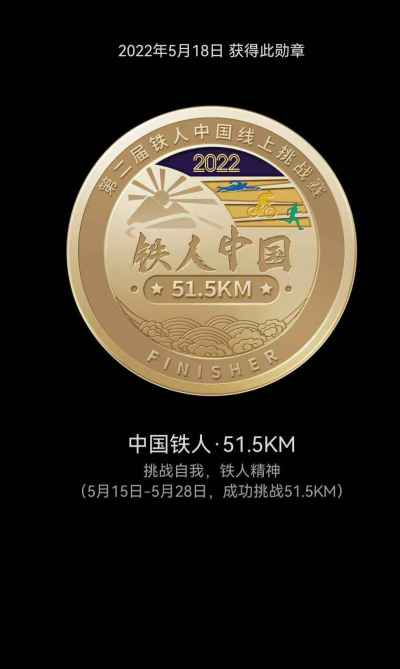
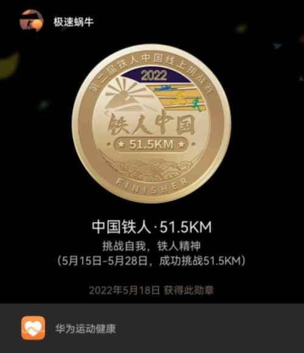

## 2022年5月18日  [生活日志](../life.md)
- 早安，独处的力量（自律） 
> 每个人都应该学会如何面对孤独，从孤独中汲取力量。独处的最高境界，就是极度自律。   
一个人只有在独处时才能成为自己。——叔本华   
>封控第66天，累计消灭了8版鸡蛋（每版30，共240颗）。     
还要继续团鸡蛋。 感谢鸡妈妈做出的贡献。  
再坚持几天，快解封了^_^  
>第二届中国铁人——疫情不能阻挡奔跑的脚步!  
- 自我    

- 董鸡    

- 团鸡蛋   

- 奔跑的脚步  

