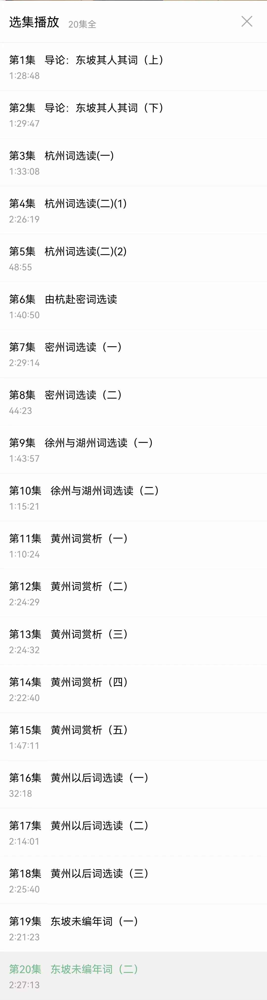

## 2022年5月19日  [生活日志](../life.md)
- 早安，东坡词（晨跑陪练）
> 清晨在《东坡词》的陪伴中跑完10km。  
从世事一场大梦，到人生几度秋凉；  
从把酒问青天，到千里共婵娟；  
从十年生死两茫茫，到自难忘；  
从一蓑烟雨任平生，到也无风雨也无晴；  
从谁道人生无再少，到门前流水尚能西；  
从大江东去，到千古风流人物；  
从一点浩然气，到千里快哉风；  
从殷勤昨夜三更雨，到又得浮生一日凉；  
从人生如逆旅，到我亦是行人；  
从俯仰人间今古，到此心安处是吾乡。  
从遥远浩瀚的千年跨越，到分秒相融的电波聆听。   
感谢一路陪伴，相知相依相恋。  
台大刘少雄老师讲的真好，喜欢诗词的朋友莫错过！  

- 晨跑      
  
- 东坡词    
  
- 东坡词   
  
