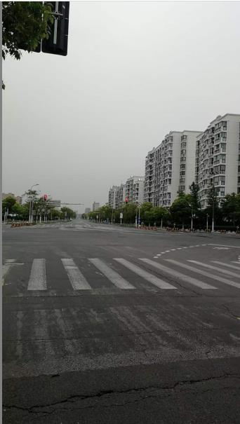
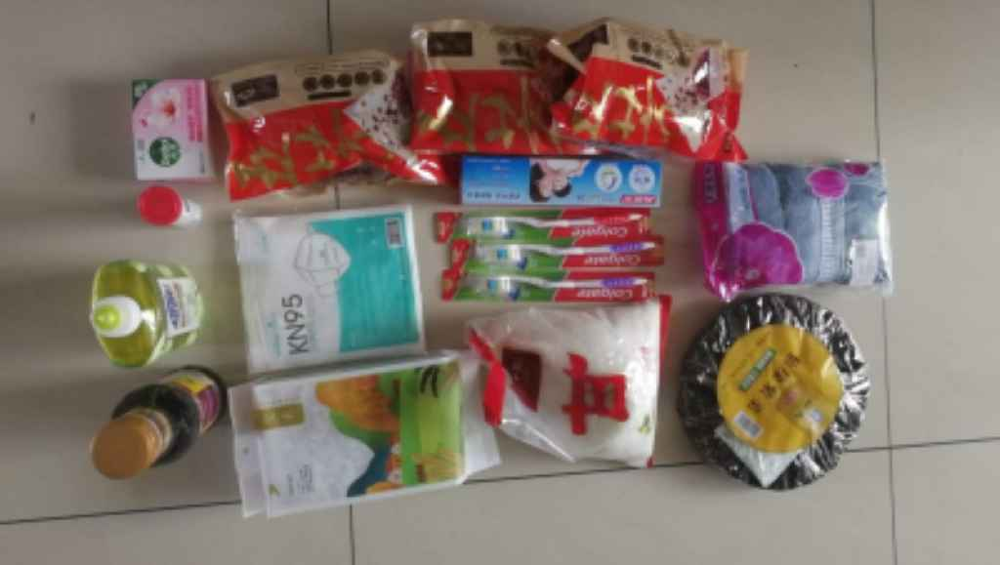

## 2022年5月21日  [生活日志](../life.md)
- 早安，坚持就是胜利（感谢投喂）
>  昨天下午外出一小时，没敢去大超市，排队人太多，堪比春运。  
小超市买了一些日用品，骑单车兜了一圈，昔日车水马龙，热闹拥挤，人头攒动的街道，此时无比空旷寂寥。  
沿街都是铁网和铁板封起来的商铺，开门营业者寥寥无几，此情此景，令人莫名的心酸无比。  
回到小区，又有新通知：21日静默，22日核酸，23日等结果，24日能否外出，静候佳音。  
这变幻莫测的节奏，令人防不胜防啊。  
目前看来，关在家里，比外出更安全。  
> 继续坚持吧，期待再次解封。  
下午，感谢投喂，物资很丰富（紫菜，白糖，生抽，洗洁精，牙刷3把，牙膏，毛巾，香皂，五芳斋粽子3包，杂粮包，泡腾片，共计11种），提前过端午了^_^  
家有余粮，心里不慌。  
越来越好，疫情必将成为过去式。

- 空旷的马路      
  
- 物资投喂    
  
