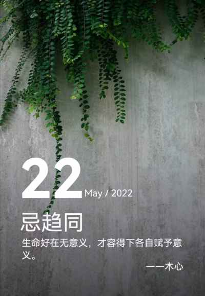

## 2022年5月22日  [生活日志](../life.md)
- 早安，生命的意义（不趋同）
>  昨晚观看《素媛》，有句对白，令人动容：我们活着，不是为了改变世界，而是为了不被世界改变。  
今早，想起乔帮主的名言：活着，就是为了改变世界。  
你，如何选择？  
普通人有选择吗？  
其实并不矛盾，首先学会共存，才能活着。
然后才会有改变的机会。  
未来会如何？  
谁又能说的清楚。  
不禁想起：  
生如蝼蚁当立鸿鹄之志，命如纸薄应有不屈之心。  
这就是生命的意义吧。

- 生命的意义      
  
