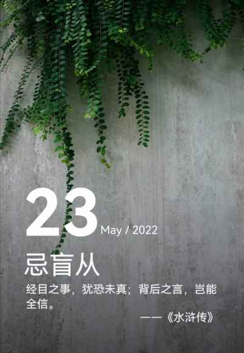

## 2022年5月23日  [生活日志](../life.md)
- 早安，真相（求解）
>  眼见为实，往往都有例外。  
更何况耳听为虚，道听途说，虚虚实实，真假难辨。  
我们在追寻真理的道路上，越走越远。  
真理又在哪里？  
远方会有梦中的诗歌和天堂吗？  
时间，把多少真理异化成了谬误。  
空间，又把多少谎言包装成了真理。  
匆匆百年，或许不用那么久远吧。  
我们在另一个时空，另一个维度。  
那些错位的空间，    
那些虚度的时间，  
会证明  
真理的意义！！！
>
- 真理      
  
