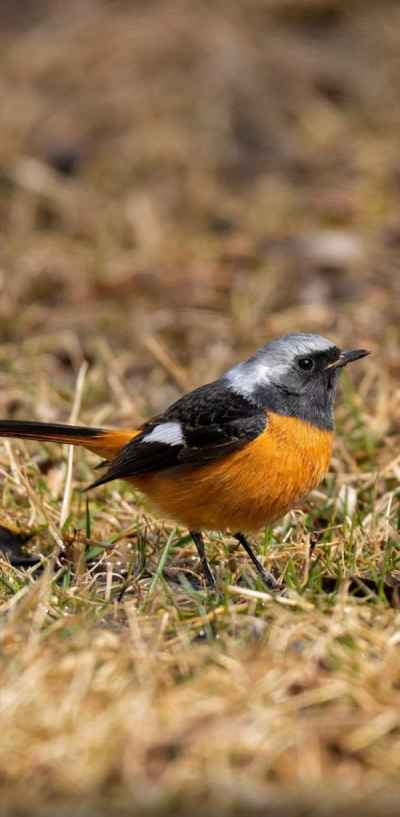

## 2022年5月26日  [生活日志](../life.md)
- 早安，光明（正前方）
>我刚当德国总理的时候（2005年），中国的 GDP 是2.3万亿美元，略低于德国（2.8万亿美元）。  
今天我要离职了，中国的 GDP 是14.7万亿，而我们的GDP是3.8万亿。  
尽管我们仍是一个相对富裕的国家，但我们在世界上的作用越来越小， 因为世界的平衡完全改变了。    
-- 德国总理默克尔回答记者提问，为什么她任内每年都去中国。    
东方雄狮从沉睡中苏醒，举世瞩目；  
东方巨龙从苏醒中腾飞，世界震撼。  
庆幸生于这个最好的时代，热爱这片生我育我的土地和国度。  
困难只是暂时的，一起加油！！！  
- 读书  

- 晨鸟   

  