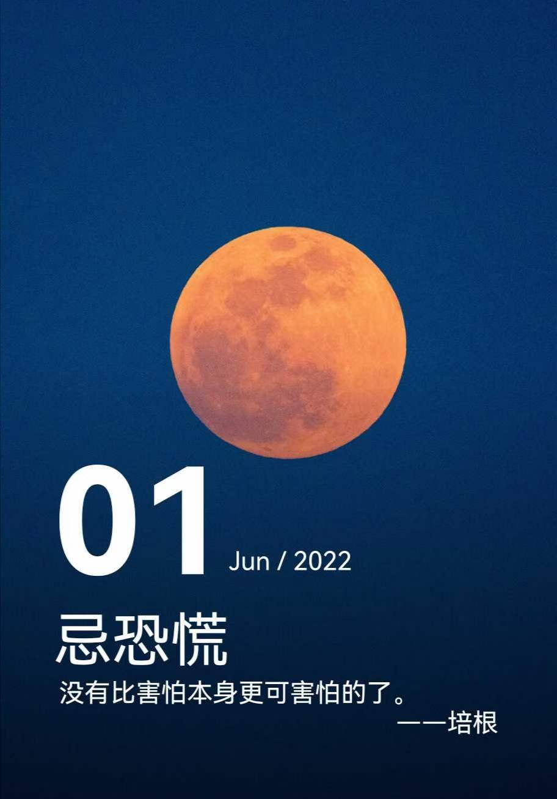
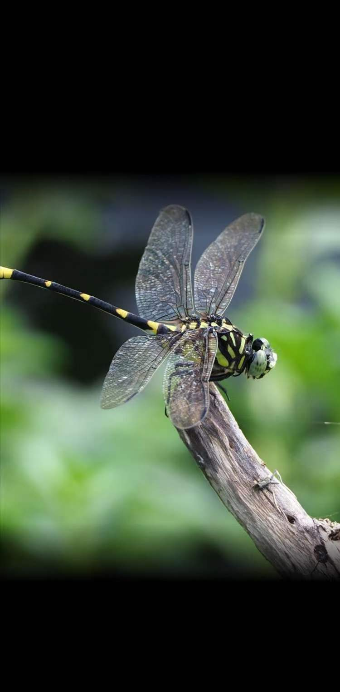
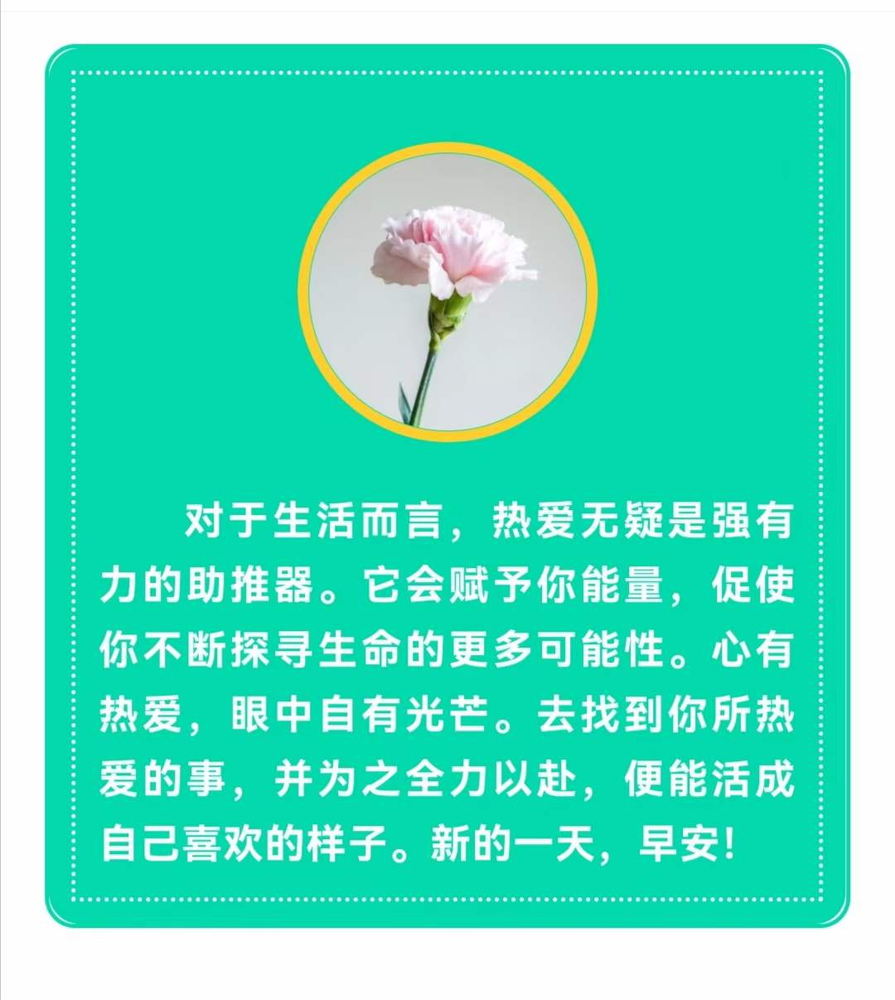

## 2022年6月1日  [生活日志](../life.md)
- 早安，节日快乐（恐慌，自由和热爱）
>你好，所有可以自由出入的人们。  
三八节过后不久，3.13日小区开始封控管理。  
经历了3.15打假，五一劳动节，五四青年节；  
跨越了清明（4.5），谷雨（4.20），立夏（5.5），小满（5.21），四个节气；  
历时79天，后期间歇外出3次4小时内（5.20,5.24,5.28），终得圆满，喜迎解封。  
六一儿童节，童真童趣，不忘初心，全新启程。  
端午节（6.3），粽情粽意，九九归一，双喜临门。  
无需多言，苦尽甘来，尽情享受这一份难得的美好。  
人生得意须尽欢。  
凌晨2点，难眠，于家中  
>
[2022年疫情大事记](../life/yq.md)
- 自由奔跑的感觉
>停跑近3个月，户外首跑10km，配速惨不忍睹。  
不过一身大汗淋漓，很爽！  
5月坚持室内打卡，作用不大，聊胜于无。  
加油，跑起来，会有风的，飞得感觉！   

- 恐慌
>没有比害怕本身更可怕的了，所以我们需要勇气。  
无论经历多少风暴，面对多少困境，我们都需要勇敢向前。

- 自由飞翔  
>不用太过艳羡能够飞行的蜻蜓，它们只是为了生存奔波而已。  
我们也可以长出思想的翅膀，自由飞翔在碧海蓝天，宇宙星空。  
  

- 热爱生活  
>什么才是生活本来的样子？  
热爱生活，接受生活的种种历练。  
喜怒哀乐只是我们情绪最真实的感性体验和本能宣泄。  
而通过理性的分析，才会让感性的认知，得以锤炼升华。    
这就是人生的意义和价值吧！

  