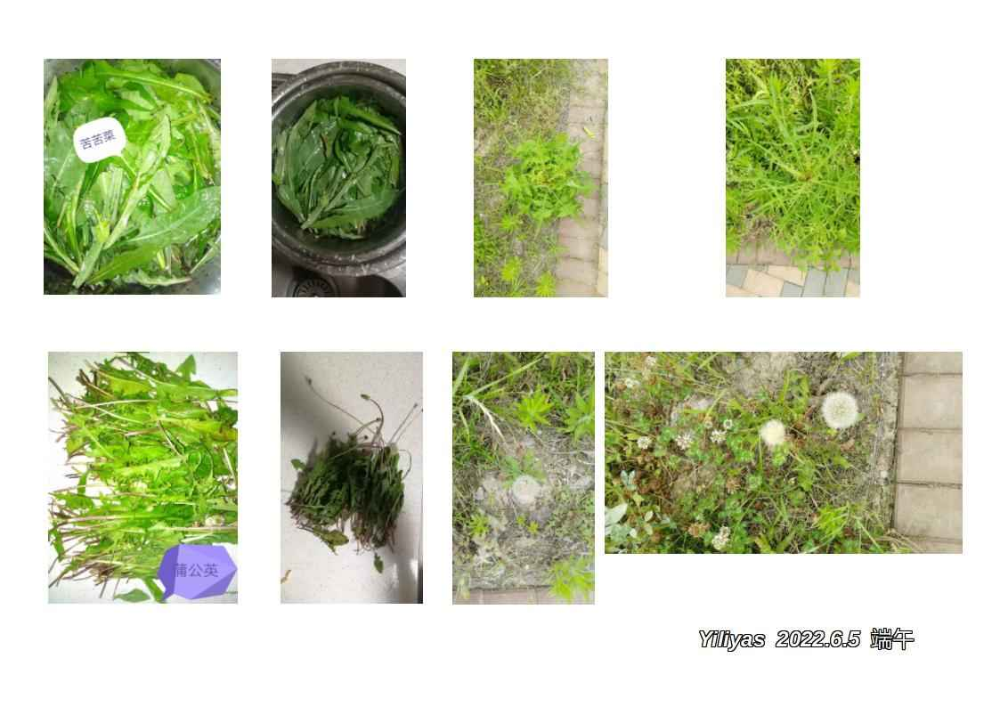
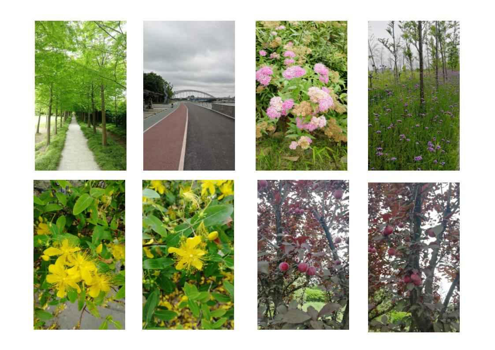

## 2022年6月5日  [生活日志](../life.md)

- 早安，端午采风（野味）
>人生苦短，没有时间去恨，只有时间去爱。  
  热爱生活，珍惜大自然的馈赠。  
  今日野味：蒲公英，苦苦菜。  
  这些昔日农家喂养家禽的野菜，如今俨然都市餐桌的美味。  
  野百合也有春天，在希望的田野上。  
> 
- 今日一言  
>小草呀，你的足步虽小，但是你拥有脚下的土地。——泰戈尔
> 
- 2022年疫情解封采风一首  

>六一解封，又迎端午。  
双喜临门，忘情自然。  
初夏时节，百花盛开。  
树荫遮日，碧草蔽径。    
红黄绿紫，桃李坠枝。  
苦菜叶肥，蒲公英籽。  
繁华都市，田野阡陌。  
烟火十足，始得人间。  

- 端午野味（苦苦菜，蒲公英）  
  
- 端午采风，花果坠枝头  
  
- 惜时    
  
  

