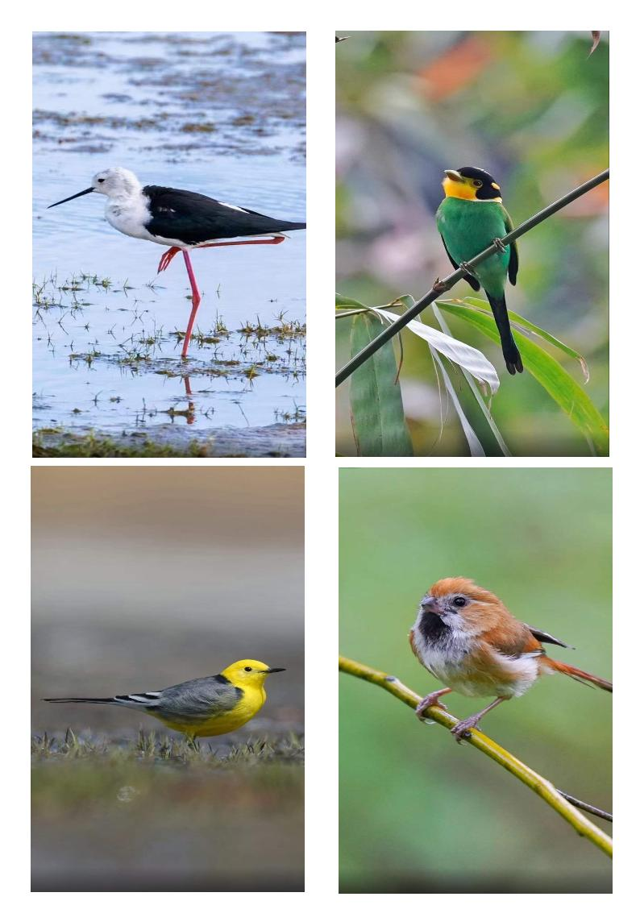
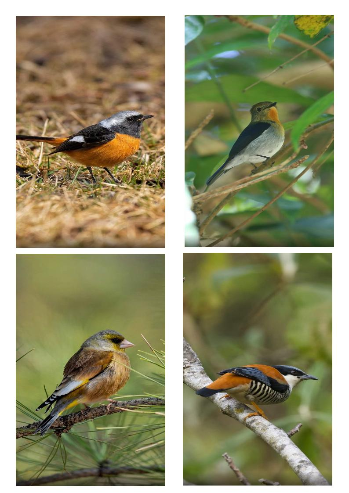
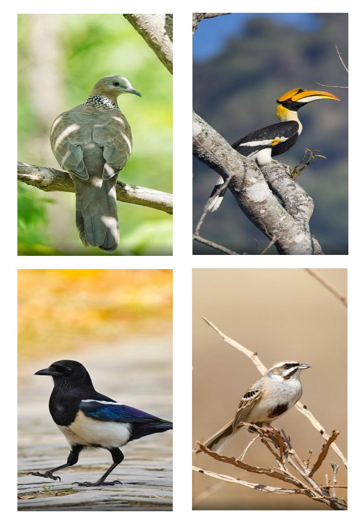
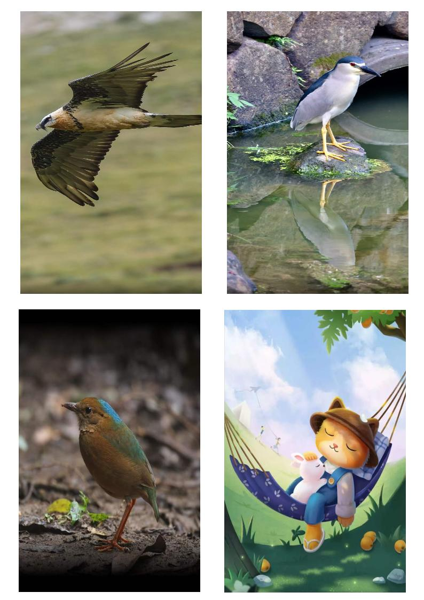
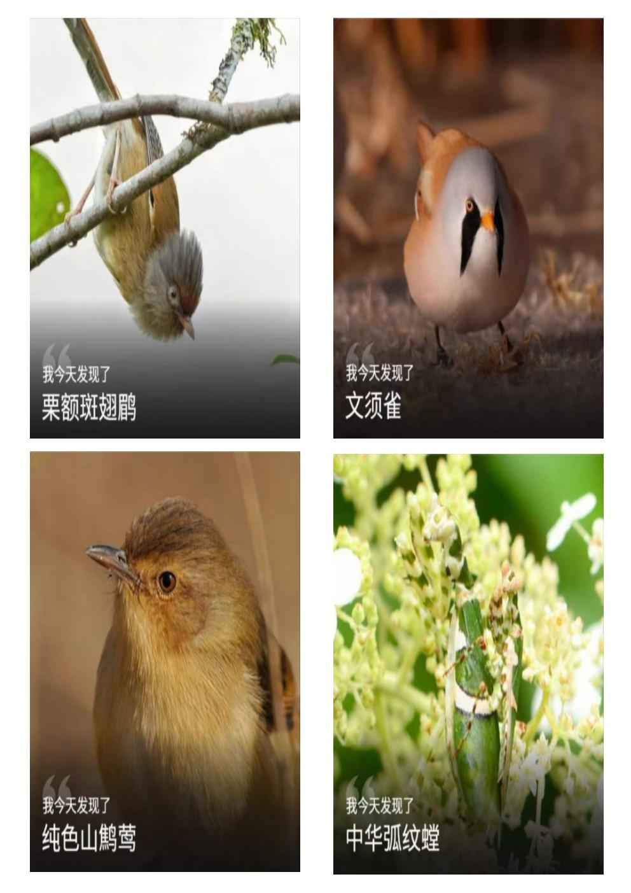
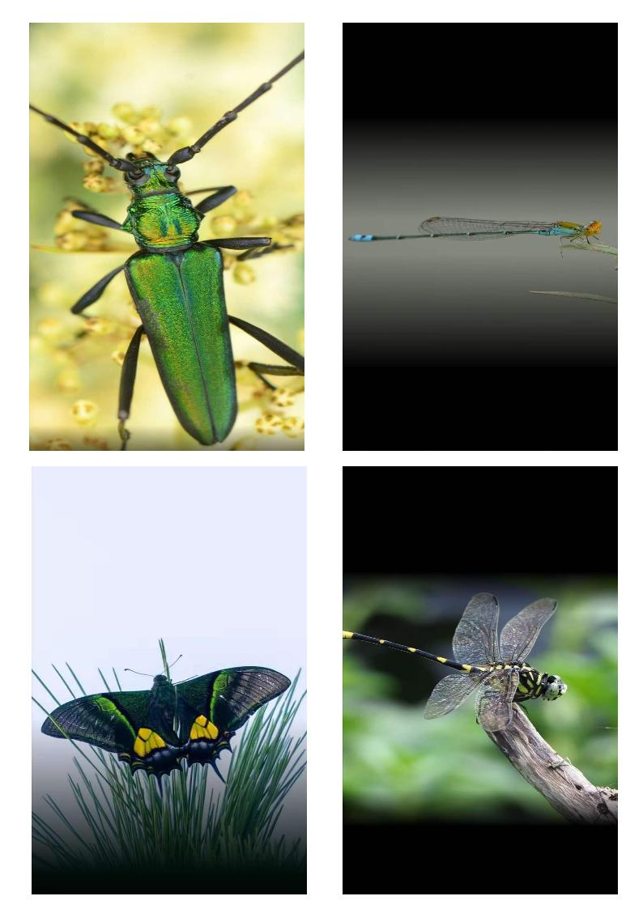
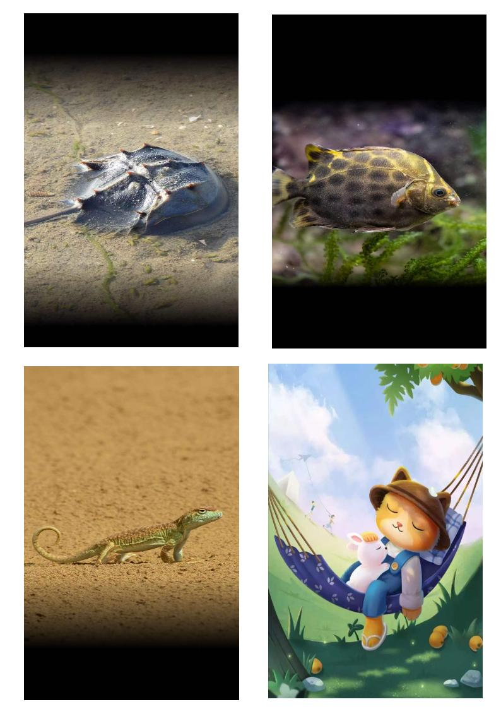

## 2022年6月08日  [生活日志](../life.md)

- 早安，美丽新世界（动物庄园）  
> 动物世界很简单，很直白。  
动物世界的规则很残忍，符合优胜劣汰自然法则。  
动物世界的需求很纯朴，为了生存，可以不顾一切。  
当鸟儿自由飞翔在蓝天；当鱼儿自由畅游在水中；  
其实，他们也很辛苦，也是为了一日三餐奔波不停。  
如果，有一天？  
鸟儿停止了飞行，鱼儿停止了游动，那一定是他们的生命走到了尽头。  
人类的世界很复杂，很矛盾，很纠结。  
其实，也可以简单一些的。  
人类，首先是动物家族的一员。  
自诩有些理智，但大多数时候，还是受到动物的本能支配吧。  
例如：吃饭，睡觉，生殖繁衍，七情六欲等等。  
我们发明了语言，文字，音乐，电影，文学，哲学，历史等；  
我们创造了社会，制度，文明，科技，不平等。  
世界越来越复杂，人类离动物世界也越来越近了。  

> 
- 鸟1  

- 鸟2    

- 鸟3   

- 鸟4    

- 鸟5

- 飞虫    

- 动物  

