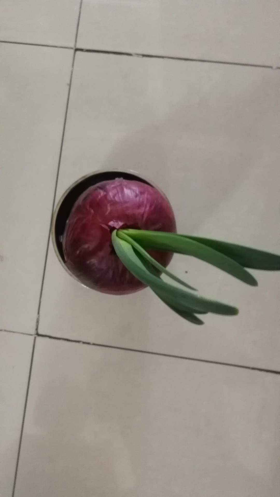
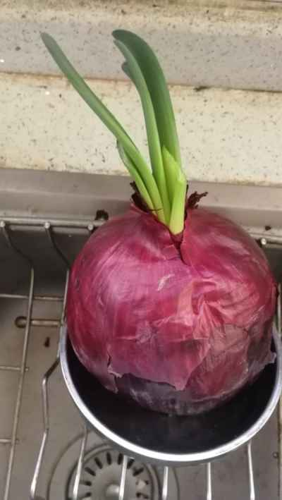
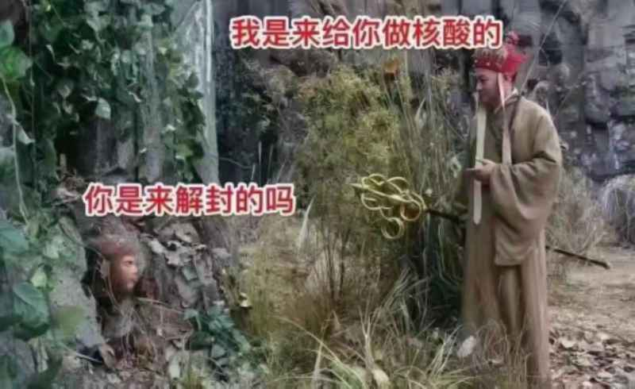
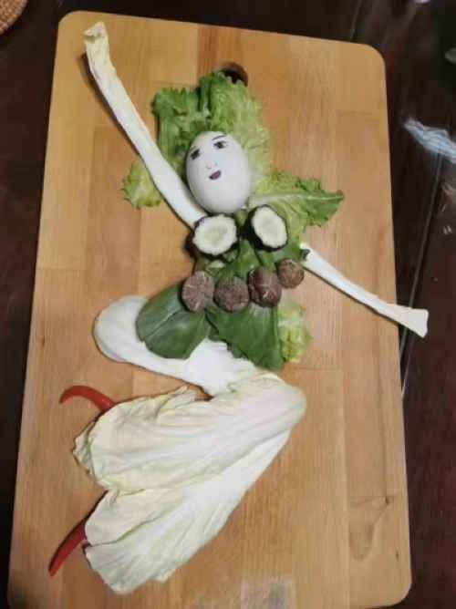
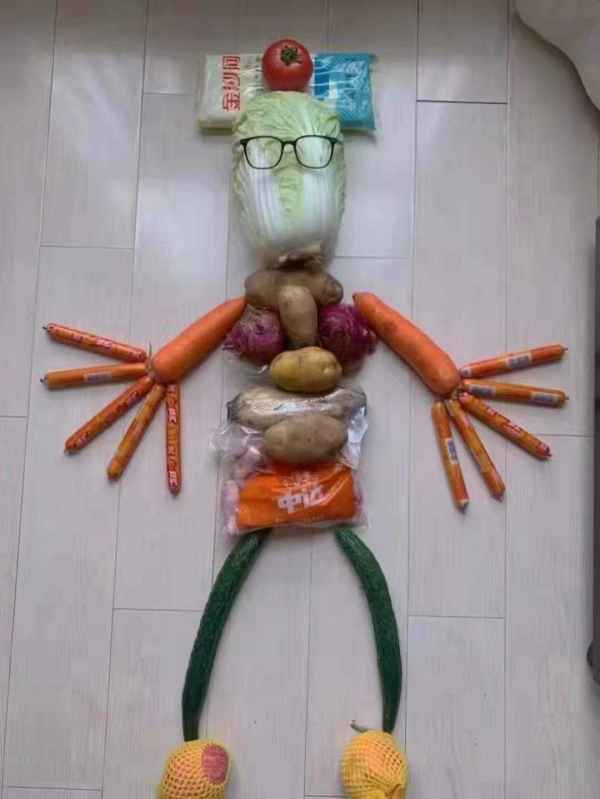
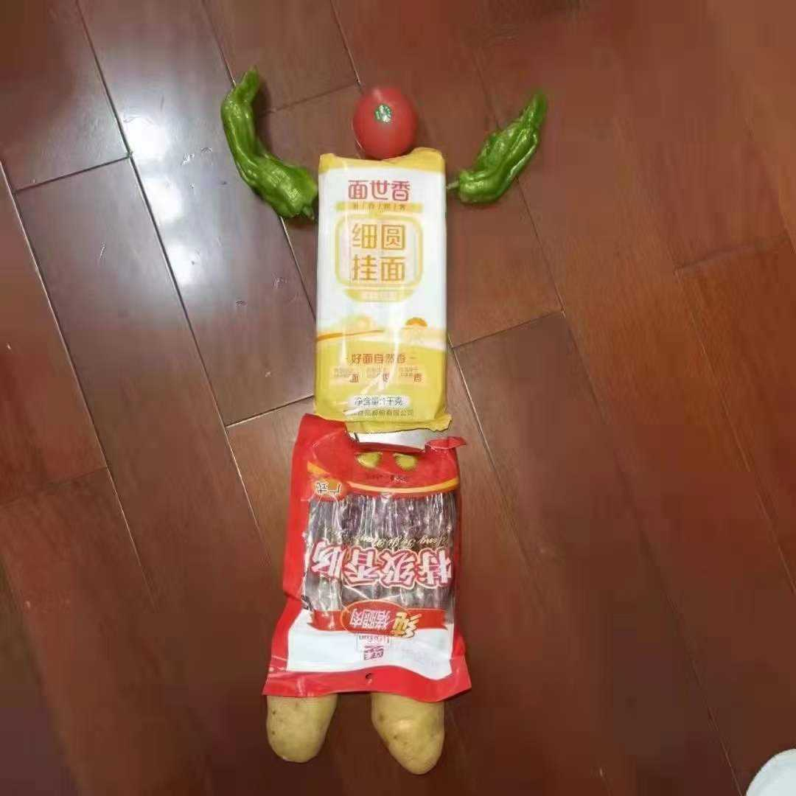
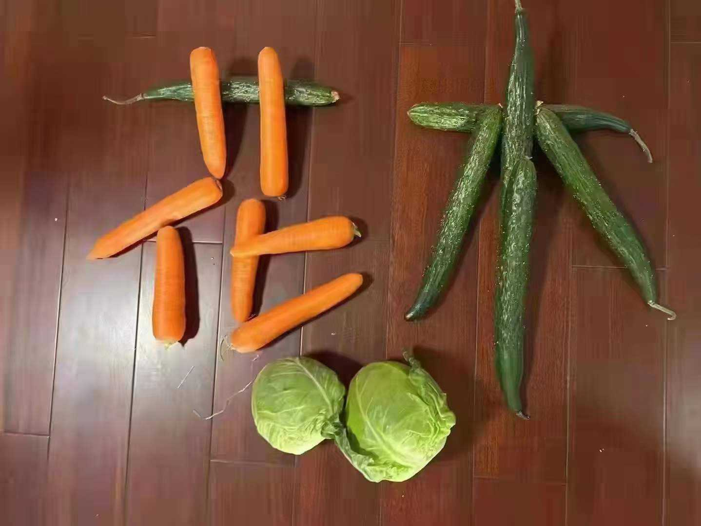
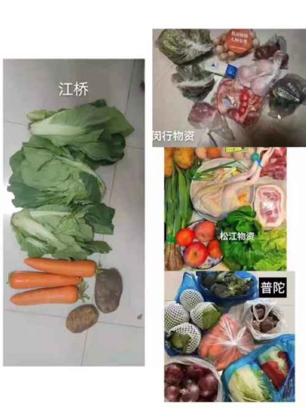

## 疫情掠影
```markdown
      《浮生偶记一则》
水培洋葱育新苗，每日一片味极鲜。
一日三餐人世间，浮生偶记不慕仙。

《疫情生活有感一则》
世事一场大梦，人生几度秋凉。
万物虚无——空即是色，色即是空。有即是无，无即是有。此中有真意，欲辨已忘言。
忌趋同——生命好在无意义，才容得下各自赋予意义。——木心
团购&核酸——什么时候开始？什么时候结束？什么也抢不到？什么都买不到？

```
- 团购&核酸  
  

- 水培洋葱育新苗
  
- 每日一片味极鲜  
  

  
## 疫情情趣
- 我是谁？猜猜猜


- 师父，救命！！！


## 疫情菜品
- 妖娆起舞

- 眼镜也疯狂  

- 干饭干饭  

- 肉呢  

- 想太多  

- 对比上海倍增


