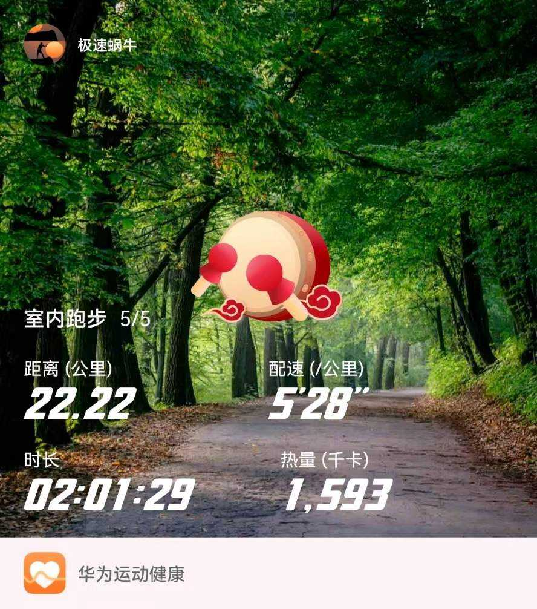
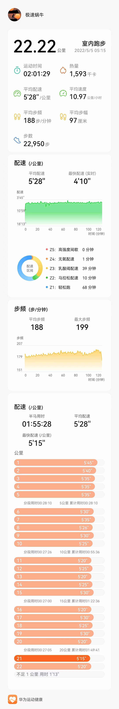

- 第25次（2022.5.5 |用时-1:55:28|配速-5:28|心率-室内5）[全部](./bm.md)
```markdown
疫情阻挡不住奔跑的脚步，第5个室内半马。
配速5分28秒，用时1小时55分左右。
今日立夏，立夏时节，万物生发，开始直立长大。
封控53天了，个人免疫力是对付疫情最强大的武器。
奔跑吧，奔5的大龄青年（国际最新标准，18岁~55岁年龄段属于青年人^_^）!
加油，期待早日解封！！！
``` 





