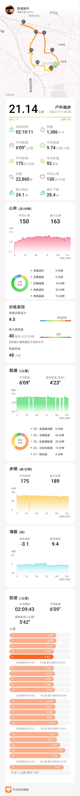

- 第30次（2022.7.17 |用时-2:9:43|配速-6:09|心率-150）[全部](./bm.md)
>30℃的盛夏，顺利完成半马。  
一定要及时补水：今天大意了，跑前喝了一瓶水，15km开始感觉干渴，19km无法保持配速，补水一瓶，坚持到终点。  
健康运动，安全第一。量力而行，科学补给。 
> 
- 附： 魔都近期最高温度 
> 7.17  37 ℃  
  7.16  32 ℃  
  7.15  37 ℃   
  7.14  40.6 ℃    
  7.13  40.9 ℃    
  7.10  40.0 ℃    

