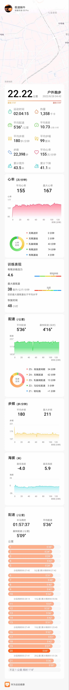

- 第31次（2022.8.28 |用时-1:57:37|配速-5:36|心率-155）[全部](./bm.md)
>25℃的初秋清晨，半马走一个。  
疫情停跑3个月（小区闭关，禁止出入）；  
高温2个月（40度的高温超过7天）
户外半马，终于重新破二了^_^ 。
> 
- 附： 魔都7，8月的极端高温日 
> 7.10  40.0 ℃    
  7.13  40.9 ℃    
  7.14  40.6 ℃    
  8.5   40.2 ℃  
  8.10  40.1 ℃  
  8.11  40.6 ℃  
  8.19  40.3 ℃  
> 

