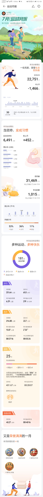

# 本月跑步小结
```
总距离：214.88 公里
总时长：22.7  小时
单次最长距离：15.07 公里
5公里最短用时：27分16秒
10公里用时最短：55分24秒
```

# 奔跑主题——夏练三伏2.0！
```
从几次半马的经验来看，几点建议：
1.三伏天跑步，最重要的还是：补水，补水，补水！
2.跑步中要克制对水的依赖和渴望，需要保持平稳的心态。
3.补水的有方法：小口，慢茗。
一饮而尽，一起干到底，都不是正确的方法。
4.补水一定要适量，过犹不及。
一次半马，可以5km，10km，15km补水三次（500升左右）！
身体的强大机能，远远超过我们想象的极限。
适量补充一些水分，不用担心会有脱水的问题。
身体健康的正常跑者，担心跑步会脱水就如同担心空腹跑会晕倒一样，有点杞人忧天了（有低血糖或其他相关疾病的人除外）
科学家们早就针对这个问题，做过深入分析研究，得出结论：一次空腹跑完全马，才会耗尽身体的能量。
所以，空腹跑20公里以内，根本不用担心，正常人的身体都复旦的起。
5.注意防晒。
遮阳帽，湿毛巾足矣。
```
#  运动月报


# 打卡记忆
```
```
