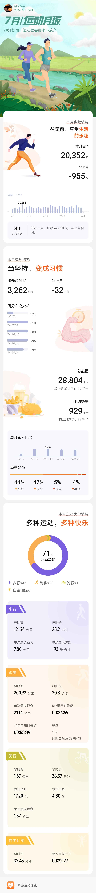

# 本月跑步小结
```
总距离：200.92 公里
总时长：20.3 小时
单次最长距离：21.14 公里
5公里最短用时：26分59秒
10公里用时最短：58分39秒
半马：1次
用时最短： 2小时09分43秒
```
# 奔跑主题——夏恋三伏，自虐 vs 自律！
> 三伏天跑步是自虐还是自律？  是挑战极限，还是死要面子活受罪？  
生活中有许多事情，都有一个很简单的判定原则：  
不忘初心。  
有些人跑步是为了炫耀和面子，为了朋友圈陌生人的点赞，获得虚拟世界的满足感。  
这样的目的，注定不能长久，也不会有真材实料的效果。  
更多的人，跑步的目的就是为了健康，从减肥开始。  
首先是bmi达标吧，不要去管配速，也不要去管步频步幅等技巧。  
只管去跑。坚持的时间长了，效果会自然涌现。  
从一口气跑1公里，到3公里，到5公里，到10公里......  
从小白到入门，水到渠成的培养了奔跑的习惯，身体和精神都有了自己的节奏和韵律。    
跑步，真的很简单，就是坚持。  
不用攀比，也不用妄自菲薄，不忘初心，坚持初心，最重要。  
我们的身体是最神奇的紧密仪器，会有各种自然反应：  
跑的太慢，她会告诉你：快一些，汗都没出，没效果的。
跑的太快，她会告诉你：慢一些，喘不过气了，到极限了。  
夏练三伏，冬练三九。  
有些人深信不疑，迷信于三伏天或者三九天运动锻炼，效果会倍增。  
朋友，你一口能吃一碗饭吗？  
朋友，你一步能跨越几百米吗？  
饭要一口一口吃，路要一步一步走。  
跑步的真谛只有这几个字：  
不忘初心，长久坚持。
>

# 打卡记忆
- 本月半马  
- 第30次（2022.7.17 |用时-2:9:43|配速-6:09|心率-150）[夏恋三伏](../running/bm30.md)
## [7月生活回忆](../life.md)

# 运动月报

